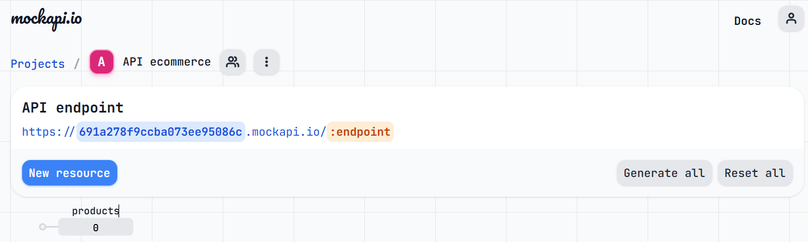
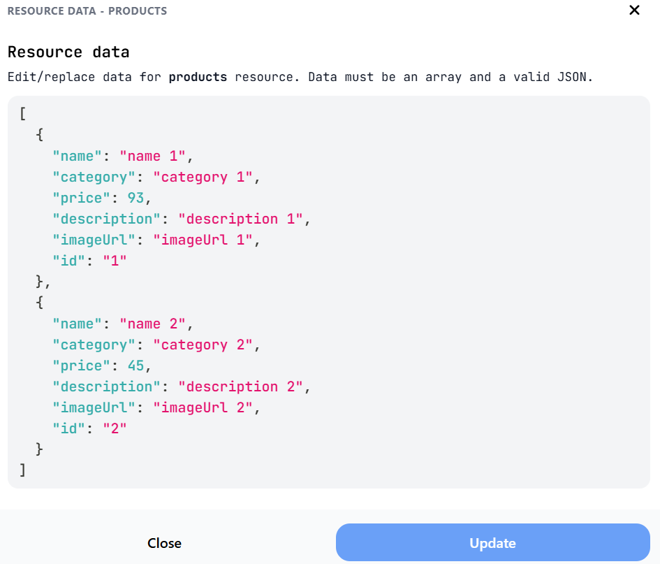
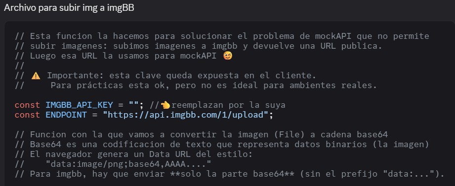

# React + Vite

This template provides a minimal setup to get React working in Vite with HMR and some ESLint rules.

Currently, two official plugins are available:

- [@vitejs/plugin-react](https://github.com/vitejs/vite-plugin-react/blob/main/packages/plugin-react) uses [Babel](https://babeljs.io/) for Fast Refresh
- [@vitejs/plugin-react-swc](https://github.com/vitejs/vite-plugin-react/blob/main/packages/plugin-react-swc) uses [SWC](https://swc.rs/) for Fast Refresh

## Expanding the ESLint configuration

If you are developing a production application, we recommend using TypeScript with type-aware lint rules enabled. Check out the [TS template](https://github.com/vitejs/vite/tree/main/packages/create-vite/template-react-ts) for information on how to integrate TypeScript and [`typescript-eslint`](https://typescript-eslint.io) in your project.

# Explicación del uso de las dos API a utilizar

## 1. Mockapi

En mi primer lugar debo abrirme una cuenta en Mockapi. Yo utilicé mi cuenta de Github, por lo tanto al loguearme me aparece la siguiente pantalla:

__Logueo en MockAPI__: 

__Estructura del recurso products (ejemplo con 2 productos)__:

__Creación de una cuenta en imgBB__

Aquí generamos la API Key que luego deberá insertarse en el archivo dado por Belu uploadImage.js; el propósito de esta API es que nos permita subir una imagen que luego se podrá usar en el campo imageURL definido en el recurso products de MockAPI.

